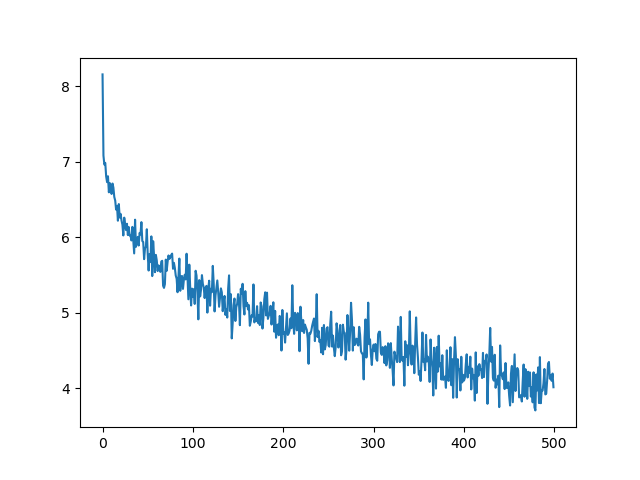

# Trump-bot

A simple Twitter bot which tries to mimic @realDonaldTrump.

[中文文档](./README_zh-cn.md)

## Table of Contents

- [Trump-bot](#trump-bot)
  - [Table of Contents](#table-of-contents)
  - [Getting Started](#getting-started)
    - [0. Prerequisites](#0-prerequisites)
    - [1. Installation](#1-installation)
    - [2. Usage](#2-usage)
  - [Learning curve](#learning-curve)
  - [TODO](#todo)
  - [Contributors](#contributors)
  - [License](#license)

## Getting Started

### 0. Prerequisites

To set up the environment, you need to have the following dependencies installed.

- [Anaconda](https://www.anaconda.com/products/individual) 4.9 or later (with Python 3.8)
- [CUDA](https://developer.nvidia.com/cuda-10.1-download-archive-base) 10.1

### 1. Installation

First, obtain the Trump-bot package.

```bash
git clone https://github.com/hakula139/Trump-bot.git
cd Trump-bot
```

Then set up a virtual environment and install the dependencies using `conda`.

```bash
conda env update --name trump_bot --file environment.yml
conda activate trump_bot
python -m spacy download en_core_web_sm
```

### 2. Usage

Train the model and evaluate the output with the following command.

```bash
python ./trump_bot/main.py
```

Currently passing parameters is not supported. You can manually modify the parameters in `./trump_bot/main.py`.

Generated texts are located in `./output/output.txt`, the figure of network learning rate is saved to `./assets/loss.png`.

## Learning curve

The training loss and validation loss using default parameters:



## TODO

- [ ] Support passing parameters
- [x] Compose a detailed document

## Contributors

- [**Hakula Chen**](https://github.com/hakula139)<[i@hakula.xyz](mailto:i@hakula.xyz)> - Fudan University

## License

This project is licensed under the GNU General Public License v3.0 - see the [LICENSE](./LICENSE) file for details.
